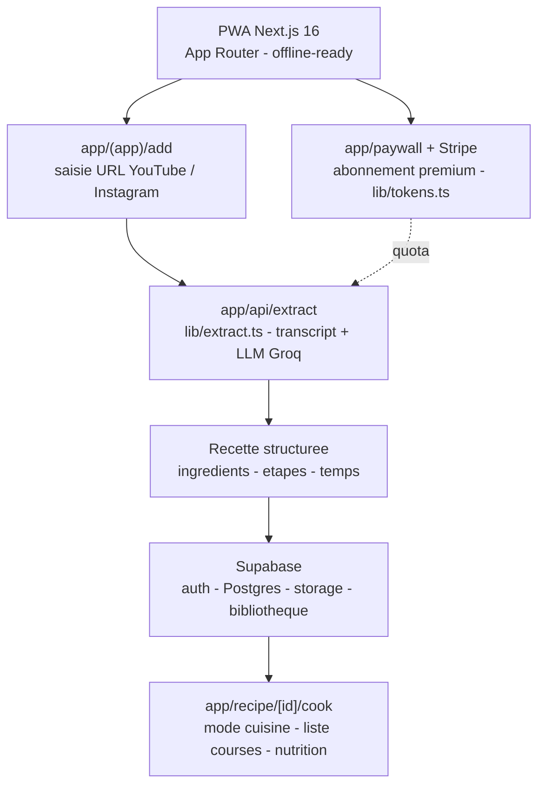

> **Depot consolide.** Version 1 en PWA, remplacee par l'application mobile.
>
> Le developpement se poursuit sur **[let-me-cook](https://github.com/Adam-Blf/let-me-cook)**.
> Ce depot est conserve en archive pour son historique.

# Let Me Cook

[](https://github.com/Adam-Blf/let-me-cook-v1/releases)

<!-- adam-badges:start -->
[](https://github.com/Adam-Blf/let-me-cook-v1/commits) [](https://hits.sh/github.com/Adam-Blf/let-me-cook-v1/) [](https://github.com/Adam-Blf/let-me-cook-v1/commits) [](https://github.com/Adam-Blf/let-me-cook-v1) [](LICENSE)
<!-- adam-badges:end -->


PWA Next.js 16 qui extrait et structure des recettes depuis des videos YouTube et Instagram. Scrape audio, transcrit, puis organise ingredients, etapes, et notes via LLM pour une cuisine sans friction.

## Architecture



## Stack

- Next.js 16 (App Router) + TypeScript
- Tailwind CSS + shadcn/ui
- Supabase (auth, Postgres, storage)
- Stripe (paiements abonnement)
- LLM pour extraction structuree de recettes
- PWA installable (offline-ready)

## Demo

A venir sur `letmecook.beloucif.com`.

## Installation

```bash
git clone https://github.com/Adam-Blf/let-me-cook-v1
cd let-me-cook-v1
npm install
cp .env.example .env.local  # remplir Supabase + Stripe + LLM keys
npm run dev
```

Ouvrir `http://localhost:3000`.

## Fonctionnalites

- Import de videos recettes YouTube / Instagram via URL
- Extraction automatique ingredients + etapes + temps de cuisson
- Sauvegarde dans bibliotheque personnelle (Supabase)
- Mode hors-ligne PWA
- Abonnement premium via Stripe
- Auth email + OAuth

## Scripts

- `npm run dev` - dev server
- `npm run build` - build production
- `npm run lint` - ESLint

## Licence

MIT

---

<p align="center">
  <sub>Par <a href="https://adam.beloucif.com">Adam Beloucif</a> - Data Engineer & Fullstack Developer - <a href="https://github.com/Adam-Blf">GitHub</a> - <a href="https://www.linkedin.com/in/adambeloucif/">LinkedIn</a></sub>
</p>


## Star History

<a href="https://www.star-history.com/?repos=Adam-Blf%2Flet-me-cook-v1&type=date&legend=top-left">
 <picture>
   <source media="(prefers-color-scheme: dark)" srcset="https://api.star-history.com/chart?repos=Adam-Blf/let-me-cook-v1&type=date&theme=dark&legend=top-left" />
   <source media="(prefers-color-scheme: light)" srcset="https://api.star-history.com/chart?repos=Adam-Blf/let-me-cook-v1&type=date&legend=top-left" />
   
 </picture>
</a>
